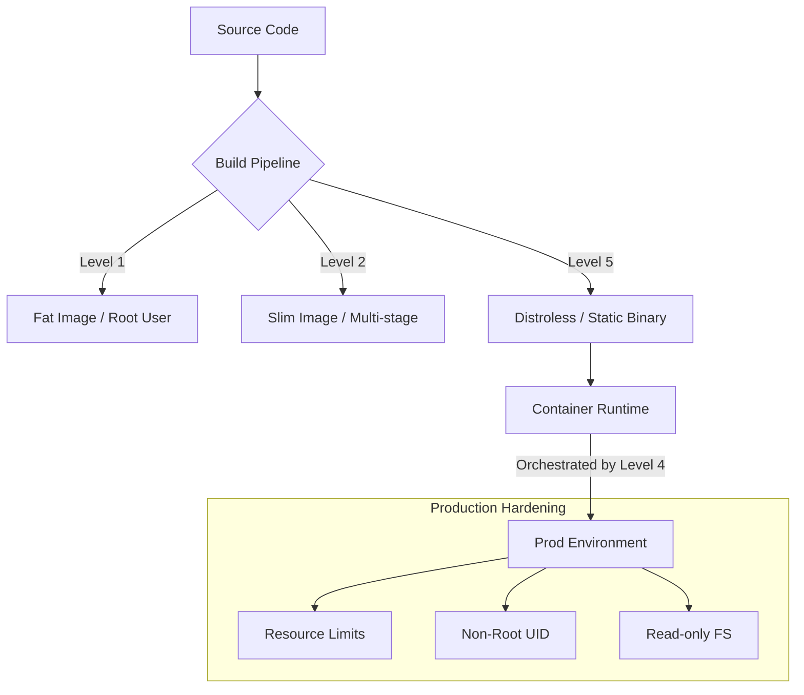

# 🐳 Docker Mastery: From Zero to Production-Grade Hero

Welcome to the ultimate reference for building, securing, and maintaining reliable Docker services! This repository is designed to be a living documentation of how we evolve a service from a simple "it runs" script to a hardened, production-ready microservice.

---

## 🚀 The Journey

Each directory in this repo represents a level of maturity in the Docker ecosystem.

### 📍 [Level 1: Foundations](./01-foundations)
*   **Focus**: Getting it to work.
*   **Concepts**: `FROM`, `COPY`, `RUN`, `CMD`.
*   **Critique**: It's functional, but the image is heavy (~900MB), runs as root, and slow to build.

### ⚡ [Level 2: Optimization](./02-optimization)
*   **Focus**: Speed and Efficiency.
*   **Concepts**: Multi-stage builds, Layer caching, `.dockerignore`.
*   **Result**: Reduced image size by ~80% and minimized build times.

### 🛡️ [Level 3: Security Hardening](./03-security-hardening)
*   **Focus**: Production Reliability.
*   **Concepts**: Non-root users (`USER node`), `HEALTHCHECK`, `npm ci`.
*   **Result**: Even if the app is compromised, the attacker has no root privileges inside the container.

### 🏗️ [Level 4: Production Orchestration](./04-production-compose)
*   **Focus**: The Ecosystem.
*   **Concepts**: `docker-compose.yml`, Resource Limits (CPU/Mem), Read-only filesystems, isolated networks.
*   **Infrastructure-as-Code**: Handling secrets and environment variables securely.

### 🏆 [Level 5: The Gold Standard](./05-the-gold-standard)
*   **Focus**: Advanced Hardening (Distroless).
*   **Concepts**: Static binaries (Go), Distroless base images, Zero-shell environments.
*   **Result**: The ultimate attack surface reduction. No `/bin/sh`, no `ls`, no shell exploits possible.

### 🌐 [Level 6: Advanced Networking](./06-advanced-networking)
*   **Focus**: Mastery of Isolation.
*   **Concepts**: Multi-tier architecture, internal bridge networks, preventing data-tier exposure.
*   **Result**: A layout where even if the frontend is breached, the database remains invisible to the outside world.

### 🤖 [Level 7: Docker for AI](./07-docker-for-ai)
*   **Focus**: High Performance Computing.
*   **Concepts**: GPU support (`nvidia-smi`), Large model weight handling, optimized layering for ML workflows.
*   **Result**: Containers that can tap into hardware acceleration for inference and training.

---

## 📚 Special Guides (The "Pro" Stop)

- **[🎯 CLI Cheatsheet](./CLI_CHEATSHEET.md)**: From basic `run` to advanced `system prune -a`.
- **[🧠 Senior Interview Guide](./INTERVIEW_GUIDE.md)**: 50+ concepts on Namespaces, Cgroups, and production scenario troubleshooting.

---

## 🔐 Security Hardening Checklist

When you're ready for production, ensure your Dockerfiles check these boxes:

- [ ] **Multi-stage builds**: Don't ship your build tools (compilers, git, etc.) to production.
- [ ] **Run as non-root**: Never let your process run as UID 0.
- [ ] **Use specific tags**: Avoid `latest`. Use `node:18-alpine` or even a SHA256 digest.
- [ ] **Scan your images**: Use tools like `trivy` or `snyk` to find vulnerabilities.
- [ ] **Read-only Filesystem**: If your app doesn't need to write, don't let it.
- [ ] **Resource Limits**: Prevent a single container from eating all the host RAM.

---

## 🛠️ How to use this for your Github
1. **Explore the folders**: Each one has a `Dockerfile` with heavy comments explaining the "Why".
2. **Build them locally**:
   ```bash
   # Build the Gold Standard
   docker build -t gold-app ./05-the-gold-standard
   ```
3. **Run them**:
   ```bash
   # Run the production stack
   cd 04-production-compose && docker-compose up
   ```

---

## 🧠 Architecture Overview



---

### humanized-note
> "Docker is easy to start, but hard to master. The difference between a developer and a DevOps architect is in the details—how you handle the layers, how you secure the process, and how you prepare for the absolute worst-case scenario. This repo is your roadmap to that mastery."

Made with ❤️ for the community.
